# How `ai-experiments` works

A single reference for the whole system: the concepts, the components, the
flows, the state on disk, and the contracts each piece honours. It is written
to be read top-to-bottom on GitHub — every diagram renders inline.

> Scope: this describes the code on `main`. The agent-driven improvement loop
> (`iax loop`, `ai_experiments/agents/`, `ai_experiments/improve/`) is landing
> through the open PR stacks — see [§14](#14-what-is-not-on-main-yet) and
> [`handoff-2026-08-29.md`](handoff-2026-08-29.md).

**Contents**

1. [The one-paragraph model](#1-the-one-paragraph-model)
2. [Three nouns: run, trial, campaign](#2-three-nouns-run-trial-campaign)
3. [System map](#3-system-map)
4. [Components and where they live](#4-components-and-where-they-live)
5. [Flow: submitting a single run](#5-flow-submitting-a-single-run)
6. [Flow: the campaign loop](#6-flow-the-campaign-loop)
7. [Flow: the monitor daemon tick](#7-flow-the-monitor-daemon-tick)
8. [Monitoring: checks, verdicts, escalation](#8-monitoring-checks-verdicts-escalation)
9. [State machines](#9-state-machines)
10. [State on disk](#10-state-on-disk)
11. [The workload contract](#11-the-workload-contract)
12. [Agent integration points](#12-agent-integration-points)
13. [Surfaces: CLI, REST, Python](#13-surfaces-cli-rest-python)
14. [What is not on `main` yet](#14-what-is-not-on-main-yet)
15. [Known limits](#15-known-limits)

---

## 1. The one-paragraph model

You write a **goal**: an objective metric, a search space, a workload command,
and a budget. The **planner** turns that goal into concrete **trials**; the
**orchestrator** submits each trial to a **backend** (a local detached process,
or a Ray cluster anywhere) as a **run**; the run reports metrics by printing
one line of stdout; the **monitor daemon** watches every active run with free
programmatic checks — killing what diverges, freezes or overruns, and only
paying for an agent when the free checks cannot decide; and each daemon tick
also advances every campaign one step: collect finished trials, re-plan, submit
more. It stops when the target is reached or the budget is spent. Everything is
persisted as plain files under one root, so any process — a CLI, the dashboard,
an agent session — can read the truth without a database.

---

## 2. Three nouns: run, trial, campaign

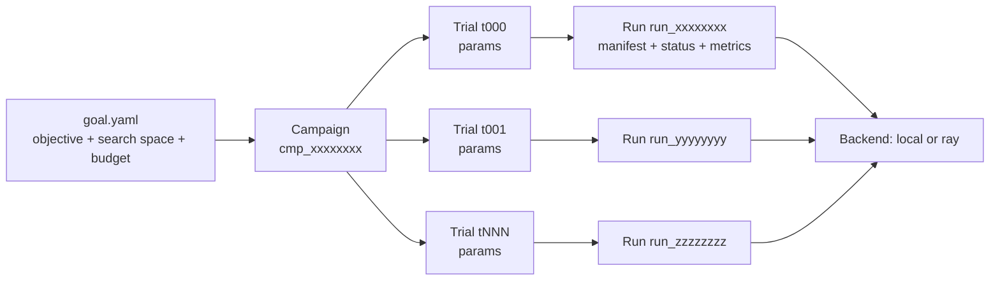

| Noun | Is | Identified by | Lives in |
|---|---|---|---|
| **Run** | one execution of one workload command | `run_<12 hex>` | `<root>/<run_id>/` |
| **Trial** | one parameter assignment inside a campaign, bound to at most one run | `t000`, `t001`, … | the campaign's `state.json` |
| **Campaign** | the pursuit of one goal: many trials over many rounds | `cmp_<12 hex>` | `<root>/_campaigns/<campaign_id>/` |

A run is usable on its own (`iax submit experiment.yaml`) — the campaign layer
is optional and sits strictly above it.

---

## 3. System map

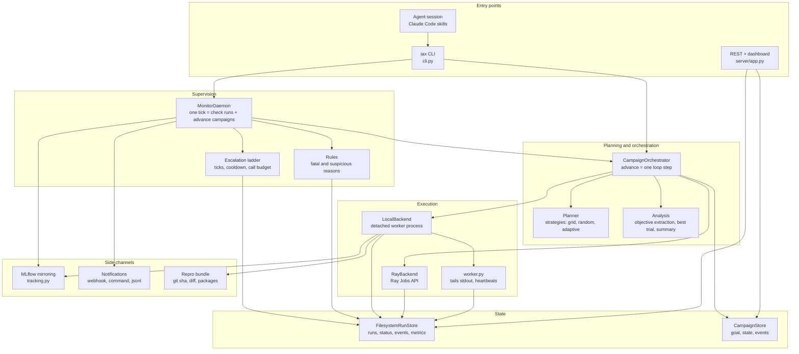

The arrows that matter: **nothing talks to anything else through memory**. The
daemon, the CLI and the dashboard all reach each other through the run store on
disk, which is why you can Ctrl+C the loop, resume it from another terminal, and
point an agent at the same directory.

---

## 4. Components and where they live

| Component | File | Responsibility |
|---|---|---|
| Schemas | `ai_experiments/schemas.py` | Every contract: manifest, goal, run status, events, metrics, decisions, trial and campaign state. Pydantic, strict, YAML/JSON round-trip. |
| CLI | `ai_experiments/cli.py` | All commands; `--json` output and exit-code contract. |
| Orchestrator | `ai_experiments/orchestrator.py` | `advance()` — one idempotent loop step; lifecycle: start, pause, resume, edit, suggest, stop. |
| Planner | `ai_experiments/planner/` | `planner.py` builds a trial manifest from a goal + params; `strategies.py` picks the next params; `search_space.py` samples/perturbs; `analysis.py` extracts the objective and summarizes. |
| Daemon | `ai_experiments/daemon.py` | The tick: diagnose active runs, act, then advance every active campaign. |
| Monitoring | `ai_experiments/monitoring/` | `rules.py` — free programmatic diagnosis; `escalation.py` — the ladder to an agent; `ray_rules.py` — Ray-specific conditions. |
| Backends | `ai_experiments/backends/` | `base.py` — the 5-method contract; `local.py`; `ray.py`; `factory.py` resolves backend + address. |
| Worker | `ai_experiments/worker.py` | Local supervisor: runs the workload, streams stdout into events and metrics, heartbeats every 15 s. |
| Store | `ai_experiments/store/` | `filesystem.py` — runs, atomic writes; `campaign.py` — campaigns. |
| Server | `ai_experiments/server/app.py` | FastAPI: dashboard + JSON REST over runs, campaigns, leaderboard, artifacts, escalations, clusters. |
| Tracking | `ai_experiments/tracking.py` | MLflow mirroring, both halves: harness-side and workload handoff. |
| Repro | `ai_experiments/repro.py` | Captures git SHA, branch, dirty flag, `diff.patch`, python/platform, package list at submit. |
| Notify | `ai_experiments/notify.py` | Webhook / command / JSONL sinks, all best-effort. |
| Clusters | `ai_experiments/clusters.py` | Named Ray cluster profiles; `iax cluster up/down/status`. |
| Report | `ai_experiments/report.py` | The workload-side API: `report_metric`, `artifacts_dir`, and the line parser. |

---

## 5. Flow: submitting a single run

### Local backend

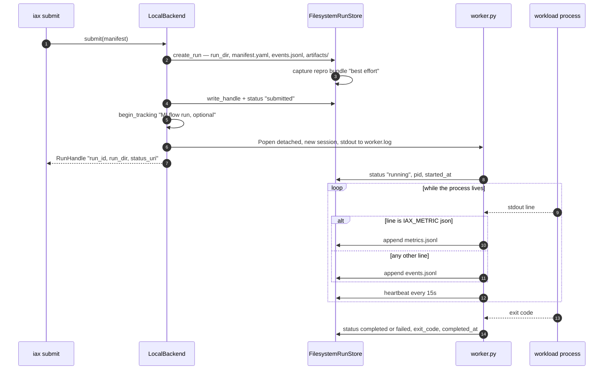

The submit call returns as soon as the supervisor is spawned; nothing blocks.
Killing the CLI does not touch the run — the worker is in its own session.

### Ray backend

Same contract, different substrate: `RayBackend` submits through the Ray Jobs
API served by the cluster dashboard, and `inspect()` maps the Ray job state onto
the generic `RunState` while recording Ray-specific detail
(`details.ray_status`, `ray_message`, `ray_log_tail`, `ray_condition`).

Address resolution is one rule, used everywhere:

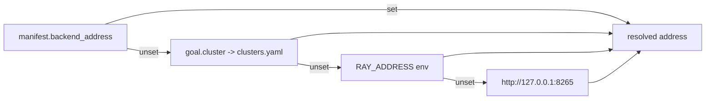

Because a Ray run has no shared filesystem, metrics are extracted from the job
logs rather than tailed, and `worker.log` / `exit_code` are local-only.

---

## 6. Flow: the campaign loop

`CampaignOrchestrator.advance()` is the whole loop, as one idempotent step.
`iax campaign start` calls it once; the daemon calls it every tick.

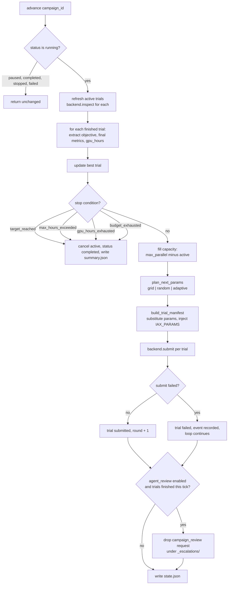

### Strategies

| Strategy | Behaviour |
|---|---|
| `grid` | Enumerates the cartesian grid at `strategy.grid_resolution` points per dimension, skipping assignments already tried. |
| `random` | Independent samples from the search space, deduplicated against history. |
| `adaptive` | Pure random for the first 3 scored trials; afterwards each draw is a fresh random sample with probability `strategy.exploration`, otherwise a gaussian perturbation around one of the `top_k` best trials. |

All three are deterministic given `(strategy.seed, prior trials)` — replanning
after a crash reproduces the same decisions.

### Search space types

| Type | Fields | Notes |
|---|---|---|
| `choice` | `values` | At least one value. |
| `uniform` | `low`, `high` | `low < high`. |
| `loguniform` | `low`, `high` | `low > 0`; sampled in log space. |
| `int` | `low`, `high` | Inclusive, `low <= high`. |

### Stop reasons

| `stop_reason` | Trigger |
|---|---|
| `target_reached` | Best objective crosses `objective.target` in the objective's direction. |
| `max_hours_exceeded` | Wall clock since campaign creation exceeds `budget.max_hours`. |
| `gpu_hours_exhausted` | Recorded + live GPU-hours (`resources.gpus` × runtime) reach `budget.max_gpu_hours`. |
| `budget_exhausted` | `budget.max_trials` planned and nothing active or queued. |
| `user_requested` | `iax campaign stop`. |

---

## 7. Flow: the monitor daemon tick

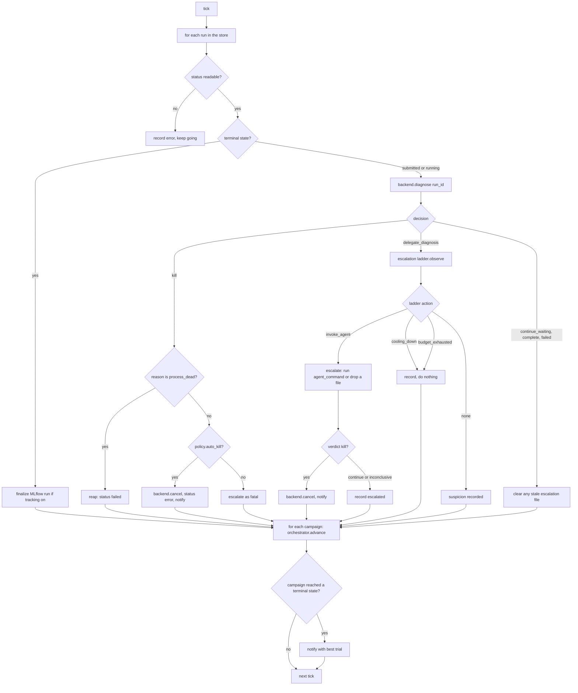

One unreadable run, one failing backend call or one broken campaign never ends
the tick — each is caught, recorded in the tick report, and the daemon moves on.

---

## 8. Monitoring: checks, verdicts, escalation

`monitoring/rules.py::diagnose_run` is pure and free. It reads status, the last
50 events, the last 200 metric points and the run's `monitoring` policy, and
returns exactly one decision.

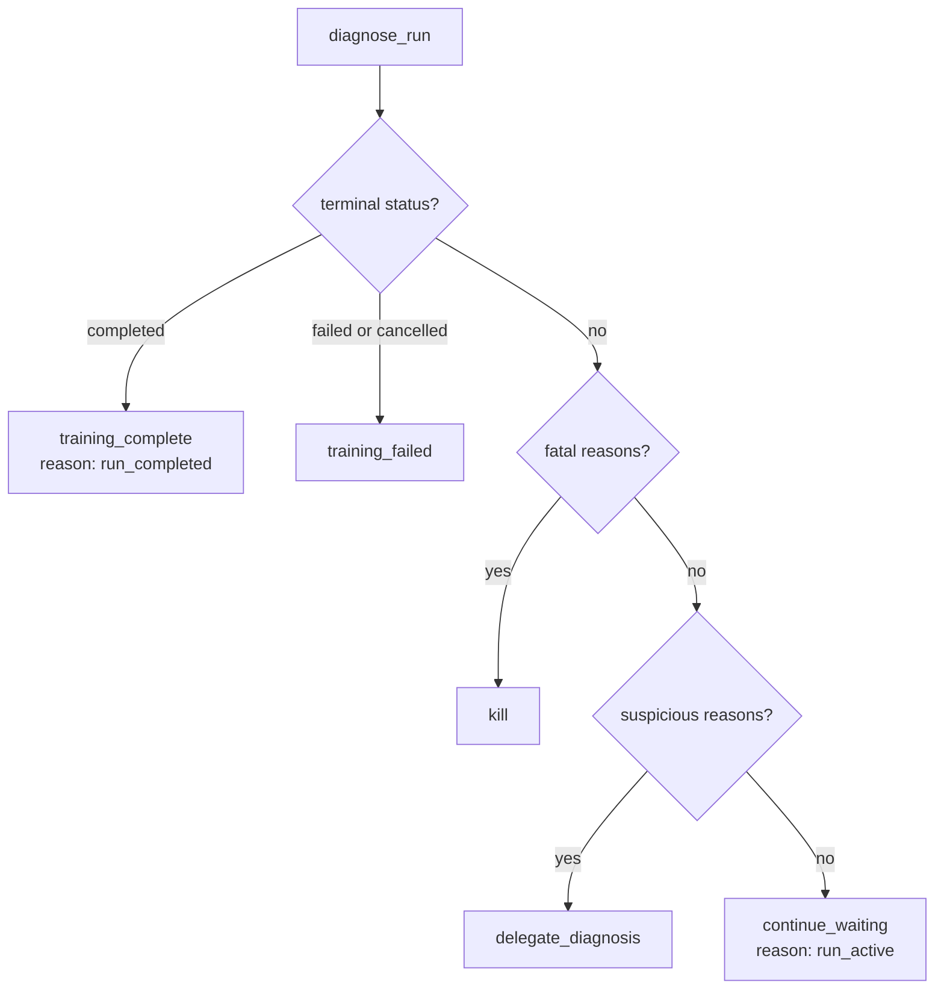

### Fatal reasons — verdict `kill`

| Reason | Condition |
|---|---|
| `non_finite_metric:<name>` | A NaN/inf value in the latest metric point, when `fatal_on_nan`. |
| `timeout_exceeded` | Age since start exceeds `monitoring.timeout_seconds`. |
| `process_dead` | Local backend, recorded pid no longer alive. Reaped as `failed`, not cancelled. |

### Suspicious reasons — verdict `delegate_diagnosis`

| Reason | Condition |
|---|---|
| `status_error_present` | The status carries an error string. |
| `ray_resource_starved` | Ray logs match a scheduling-starvation pattern. |
| `ray_stuck_suspected` | Ray logs match actor death / deadlock / heartbeat timeout / node failure. |
| `heartbeat_stale_for_<n>m` | No worker heartbeat for more than 3 minutes (cadence is 15 s). |
| `no_metric_progress_for_<n>m` | Latest metric older than `stuck_after_minutes`. |
| `objective_plateau:<metric>:<n>_points` | The last `plateau_patience_points` never beat anything before them, in either direction. |
| `no_status_update_for_<n>m` | No metrics at all and the status is stale. |
| `no_event_progress_for_<n>m` | No metrics at all and events are stale. |
| `no_run_events` | Active run that has produced nothing, and Ray is not reporting it as queued/running. |

### The escalation ladder

Programmatic ticks are free; an agent costs tokens. The ladder is the valve.

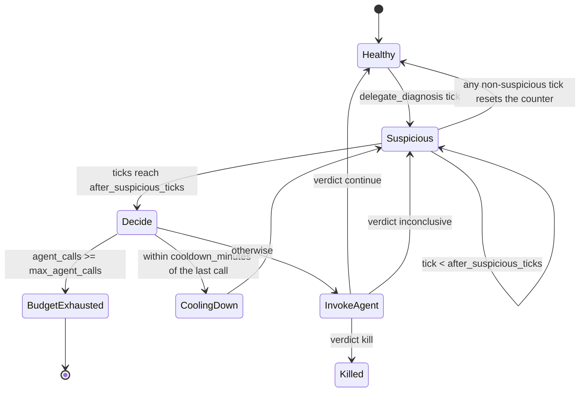

Per-run ladder state persists in `<run_dir>/escalation.json`, so a daemon
restart does not reset the budget.

With **no** `agent_command` configured, `invoke_agent` writes
`<root>/_escalations/<run_id>.json` and nothing else — zero tokens spent by the
harness. An external agent session picks it up via `iax escalations`.

With an `agent_command`, the daemon shells out (`{run_id}` and `{run_dir}` are
substituted), parses a JSON `{"verdict": "kill"|"continue"|"inconclusive",
"reason": "..."}` from stdout, and acts on it. Unparseable output is
`inconclusive` — never fatal.

---

## 9. State machines

### Run

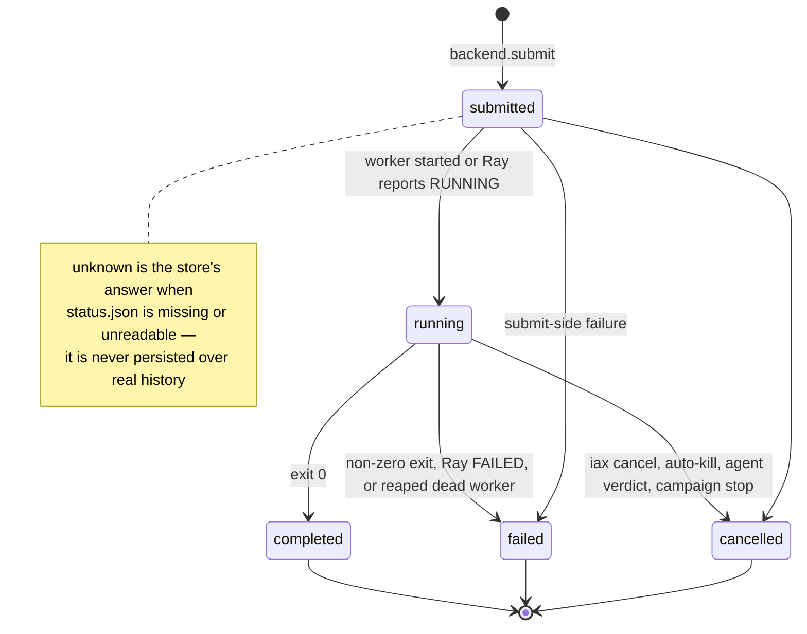

### Trial

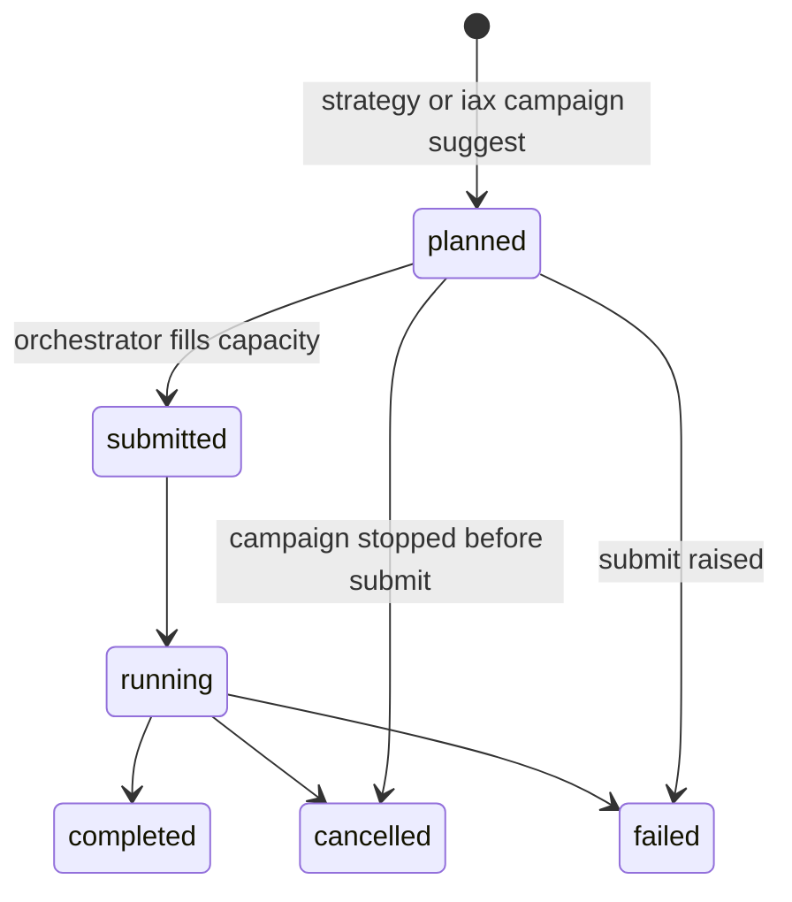

Trial state mirrors its run's state; `completed`, `failed` and `cancelled` also
freeze `objective_value`, `final_metrics` and `gpu_hours`.

### Campaign

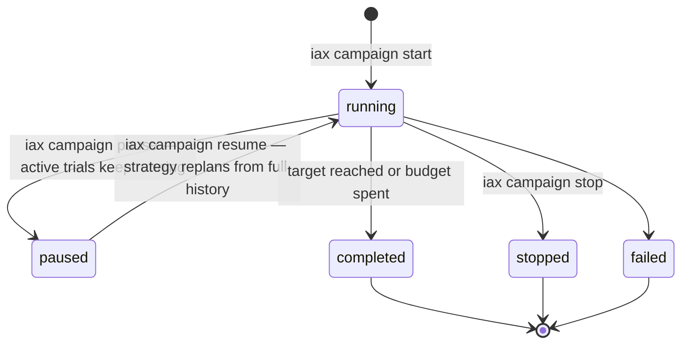

`iax campaign edit` replaces the goal in place while paused — the search space,
budget and strategy change, the trial history is kept and feeds the strategy.
Changing `objective.metric` is rejected: recorded values would stop being
comparable.

---

## 10. State on disk

One root, everything greppable. Default `outputs/experiments/runs`, overridden
by `IAX_RUNS_DIR` or `--runs-dir`.

```
<root>/
├── run_a1b2c3d4e5f6/
│   ├── manifest.yaml          # the exact submitted manifest
│   ├── status.json            # RunStatus — atomically replaced, never torn
│   ├── events.jsonl           # RunEvent per line: harness events + workload stdout
│   ├── metrics.jsonl          # MetricPoint per line, from IAX_METRIC lines
│   ├── escalation.json        # ladder state: suspicious ticks, agent calls
│   ├── worker.log             # local backend only: raw supervisor + workload output
│   ├── artifacts/             # $IAX_ARTIFACTS_DIR — checkpoints, plots, models
│   └── repro/
│       ├── context.json       # git sha, branch, dirty, python, platform, packages
│       └── diff.patch         # uncommitted changes at submit time
├── _campaigns/
│   └── cmp_0f1e2d3c4b5a/
│       ├── goal.yaml          # the goal, replaced by `campaign edit`
│       ├── state.json         # CampaignState: every trial, best, rounds, status
│       ├── events.jsonl       # trial submitted / finished, pause, resume, edit
│       └── summary.json       # written once, when the campaign finishes
├── _escalations/
│   ├── run_a1b2c3d4e5f6.json  # a run the free checks could not decide
│   └── campaign_cmp_0f1e....json  # an agent_review request between rounds
└── _notifications.jsonl       # every alert, whatever the sink did
```

Two persistence rules worth knowing:

- **Atomic writes.** `status.json` and `state.json` are written to a sibling
  temp file and `os.replace`d, so no reader ever sees a half-written document.
  This makes each write indivisible; it does **not** serialize concurrent
  read-modify-write sequences (see [§15](#15-known-limits)).
- **No fabricated history.** When `status.json` is missing or unreadable the
  store returns a *synthetic* status marked `_synthetic`, and refuses to write
  on top of one. An unreadable run surfaces as a tick error, not as invented
  state.

> `repro/diff.patch` is a diff of your working tree. Read it before publishing a
> run directory anywhere.

---

## 11. The workload contract

A workload is any command. It becomes an iax workload by printing one line:

```python
print('IAX_METRIC {"step": 12, "loss": 0.0734}')

# or, equivalently:
from ai_experiments.report import report_metric
report_metric(step=12, loss=0.0734)
```

That single line works identically on the local backend (the worker tails
stdout) and on a remote Ray cluster with no shared filesystem (the harness
extracts the lines from job logs). Non-finite values are preserved on purpose —
detecting them is the monitor's job.

### Environment the harness injects

| Variable | Set by | Meaning |
|---|---|---|
| `IAX_RUN_ID` | worker | The run's id. |
| `IAX_RUN_DIR` | worker | The run directory. |
| `IAX_ARTIFACTS_DIR` | worker | Where to write checkpoints/plots/models; `report.artifacts_dir()` returns it. |
| `IAX_PARAMS` | planner | JSON of the trial's parameter assignment. |
| `IAX_TRIAL_ID` | planner | `t000`, `t001`, … |
| `MLFLOW_RUN_ID`, `MLFLOW_TRACKING_URI` | tracking | Present when `tracking.mlflow` is on, so the workload logs into the *same* MLflow run the harness created. |

### How parameters reach the command

`build_trial_manifest` injects each assignment three ways, so any workload style
works without adaptation:

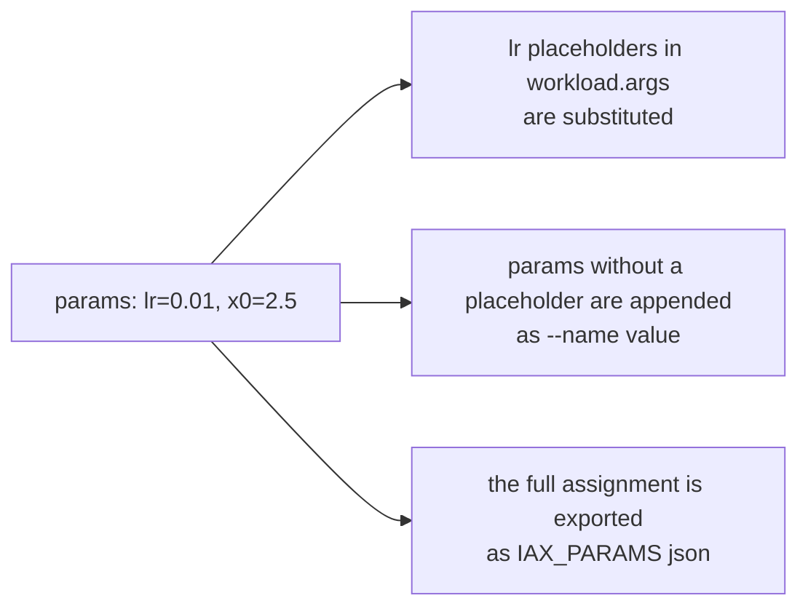

---

## 12. Agent integration points

The daemon and the planner are fully programmatic. Agents are opt-in at exactly
three seams, and each one is a file, not an API:

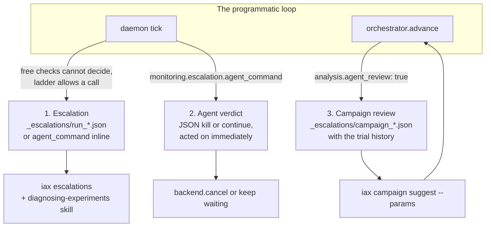

| Seam | Enabled by | What the agent does |
|---|---|---|
| **Escalations** | default | `iax escalations` lists runs the free checks flagged; the agent triages and decides. |
| **Agent verdicts** | `monitoring.escalation.agent_command` | The daemon itself invokes the agent and acts on a JSON `kill` / `continue` verdict. |
| **Campaign review** | `analysis.agent_review: true` | Each round drops a review request with the trial summary; the agent queues better trials with `iax campaign suggest`. |

The repo also ships skills (`submitting-experiments`, `monitoring-experiments`,
`diagnosing-experiments`, `cancelling-experiments`) that teach a Claude Code
agent to drive the CLI — see the README's *Agent skills* section.

---

## 13. Surfaces: CLI, REST, Python

### CLI map

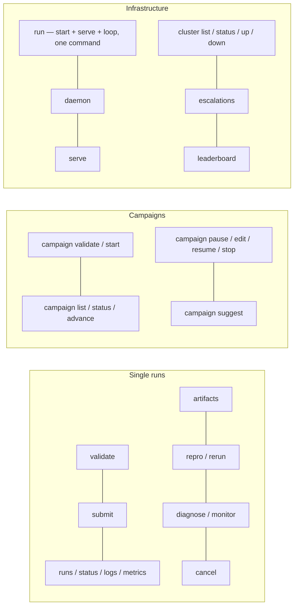

`iax run goal.yaml` is the whole system in one command: it starts the campaign,
serves the dashboard in a thread, and drives ticks until the campaign finishes.
Ctrl+C detaches without killing anything; `iax daemon` resumes the loop.

`iax monitor <run_id> --json --quiet-when-waiting` is the scheduler integration
point: silent while the run should keep waiting, JSON only when something needs
a decision.

### REST API

| Method | Path | Returns |
|---|---|---|
| `GET` | `/` | The dashboard. |
| `GET` | `/api/health` | Liveness. |
| `GET` | `/api/runs` | All runs. |
| `GET` | `/api/runs/{run_id}` | One run's status. |
| `GET` | `/api/runs/{run_id}/events` | Events, `?tail=`. |
| `GET` | `/api/runs/{run_id}/metrics` | Metric points, `?tail=`. |
| `GET` | `/api/runs/{run_id}/diagnosis` | The current programmatic verdict. |
| `POST` | `/api/runs/{run_id}/cancel` | Cancel. |
| `GET` | `/api/runs/{run_id}/artifacts` | Artifact listing. |
| `GET` | `/api/runs/{run_id}/artifacts/{path}` | Artifact download. |
| `GET` | `/api/runs/{run_id}/repro` | The captured repro context. |
| `GET` | `/api/leaderboard` | Campaigns ranked by best objective, with GPU-hours and cost. |
| `GET` | `/api/campaigns` | All campaigns. |
| `GET` | `/api/campaigns/{id}` | One campaign with its trials. |
| `POST` | `/api/campaigns/{id}/stop` · `/pause` · `/resume` | Lifecycle. |
| `GET` | `/api/escalations` | Pending escalations. |
| `GET` | `/api/clusters` | Configured cluster profiles. |

### Python

Every layer is importable and injectable — the orchestrator takes a
`backend_factory`, the rules take a `pid_alive` callable, the Ray backend takes a
`client_factory`. That is how the test suite runs the whole loop without a
cluster.

```python
from ai_experiments.schemas import GoalSpec
from ai_experiments.store import FilesystemRunStore
from ai_experiments.orchestrator import CampaignOrchestrator

store = FilesystemRunStore("outputs/experiments/runs")
orch = CampaignOrchestrator(store)
state = orch.start(GoalSpec.from_yaml("examples/goal_toy.yaml"))
state = orch.advance(state.campaign_id)
```

---

## 14. What is not on `main` yet

The agent-driven improvement loop — one chat message to a finished campaign —
is built and proven on a merged integration branch, but lands through stacked
PRs. It adds `ai_experiments/agents/` (invoke an agent, parse its contract,
`strategy: agent`), `ai_experiments/improve/` and `loop.py` (rounds, workload
variants, the closed loop), `ai_experiments/api.py` (the public Python surface),
the `iax loop` / `iax new` / `iax campaign trials` commands, and the
`autonomous-experimentation` skill.

Read [`handoff-2026-08-29.md`](handoff-2026-08-29.md) for the merge order, the
evidence, and the remaining tickets. Read
[`assessment-y-plan-2026-09-07.md`](assessment-y-plan-2026-09-07.md) for the
critique of the current design and the target architecture.

---

## 15. Known limits

| Limit | Detail |
|---|---|
| Concurrent status writes | Atomic writes make each write indivisible, not read-modify-write sequences serializable. Concurrent updaters can lose whole fields to last-writer-wins — issue #30. |
| `worker.log` and `exit_code` | Local backend only. On Ray, worker output lives in `status.error` and `details.ray_log_tail`, and `exit_code` stays `None`. |
| Remote artifacts | `iax artifacts` and the dashboard's download links cover the local backend. On a remote Ray cluster, artifacts stay on the cluster's storage unless the workload ships them to MLflow. |
| Repro fidelity | The bundle captures *context* — git SHA, diff, package list — not a restorable execution environment. |
| Ray integration suite | `tests/integration/compose.yaml` claims host ports 8265 and 5000 and pins Ray 2.37.0; on a host with a cluster already up it stays skipped. `uv run --extra dev python -m pytest tests` is the gate. |
| Tracking is best-effort | A missing mlflow package or an unreachable server records a warning event and never blocks a submit or a tick. The same holds for notifications and repro capture. |
